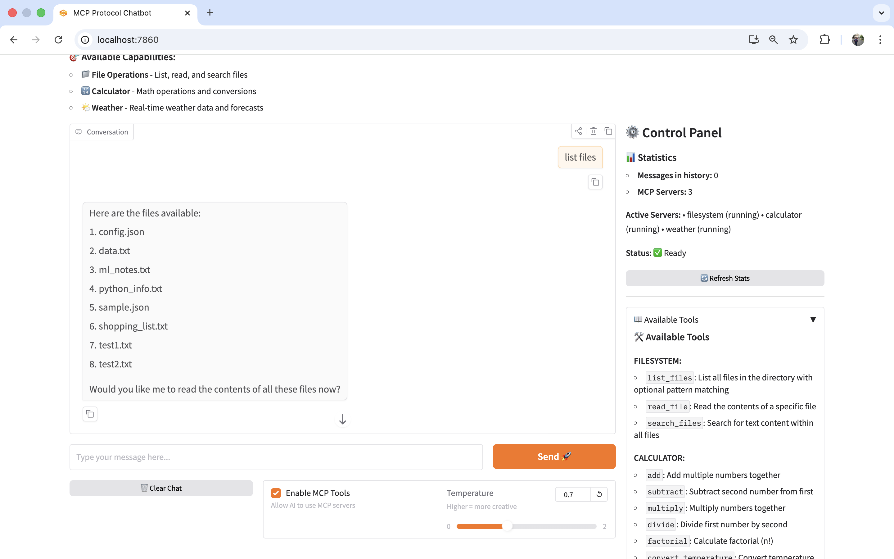
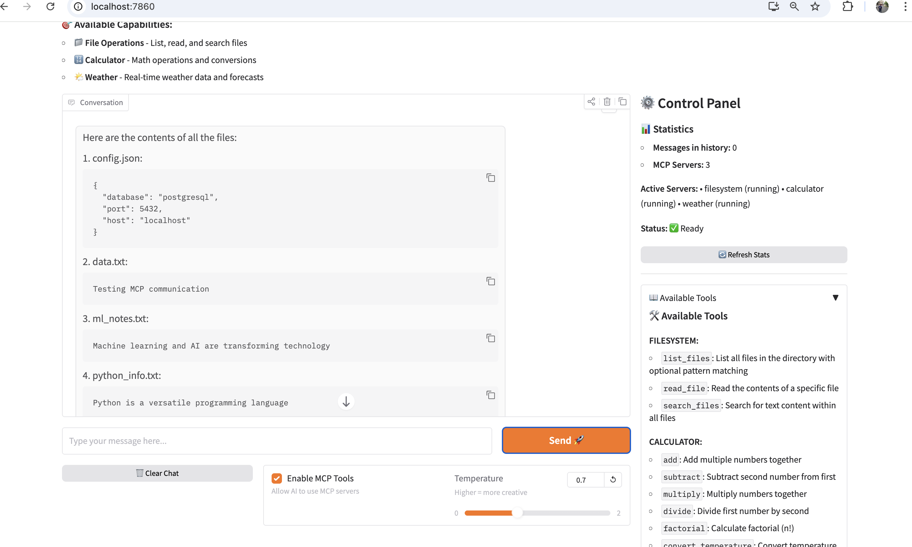

# Content Generation Bot with MCP Protocol

A production-ready AI chatbot built with **Azure OpenAI**, **Gradio**, and the **Model Context Protocol (MCP)**, featuring real-time tool execution across multiple specialized servers.


---


---

## ✨ Features

### 🎯 Core Capabilities
- **📁 File Operations** - List, read, and search files with pattern matching
- **🔢 Advanced Calculator** - Math operations, factorials, and scientific calculations
- **🌡️ Unit Conversions** - Temperature (C/F/K) and distance (m/ft/mi/km) conversions
- **🌤️ Weather Information** - Current weather, forecasts, and city comparisons

### 🚀 Technical Highlights
- ✅ **Real MCP Protocol** - Authentic stdio-based communication using JSON-RPC 2.0
- ✅ **Multi-Server Architecture** - Isolated MCP servers running as separate processes
- ✅ **AI Tool Calling** - Intelligent tool selection and execution via Azure OpenAI
- ✅ **Async/Await** - Fully asynchronous Python architecture
- ✅ **Gradio 6.0 UI** - Modern, responsive web interface
- ✅ **Conversation History** - Context-aware conversations with configurable memory
- ✅ **Error Handling** - Robust error recovery and user-friendly messages

---

## 📊 System Overview

```
┌─────────────────────────────────────────────────────────┐
│                    Gradio Web UI                        │
│              (User Interface Layer)                     │
└────────────────────┬────────────────────────────────────┘
                     │
                     ▼
┌─────────────────────────────────────────────────────────┐
│              Azure OpenAI Client                        │
│         (AI Reasoning & Tool Selection)                 │
└────────────────────┬────────────────────────────────────┘
                     │
                     ▼
┌─────────────────────────────────────────────────────────┐
│                MCP Client                               │
│         (Protocol Handler & Orchestrator)               │
└──────┬──────────────┬──────────────┬───────────────────┘
       │              │              │
       ▼              ▼              ▼
┌──────────┐   ┌──────────┐   ┌──────────┐
│Filesystem│   │Calculator│   │ Weather  │
│  Server  │   │  Server  │   │  Server  │
│(3 tools) │   │(7 tools) │   │(4 tools) │
└──────────┘   └──────────┘   └──────────┘
```

---

## 🎯 Available Tools (14 Total)

### 📁 Filesystem Server (3 tools)
- `list_files` - List files with pattern matching
- `read_file` - Read file contents
- `search_files` - Search text across all files

### 🔢 Calculator Server (7 tools)
- `add` - Add multiple numbers
- `subtract` - Subtract two numbers
- `multiply` - Multiply multiple numbers
- `divide` - Divide with precision control
- `factorial` - Calculate factorial (0-20)
- `convert_temperature` - Convert C/F/K
- `convert_distance` - Convert m/ft/mi/km

### 🌤️ Weather Server (4 tools)
- `get_current_weather` - Current conditions for any city
- `get_forecast` - Multi-day weather forecast (1-7 days)
- `list_cities` - Show all available cities
- `compare_weather` - Compare two cities side-by-side

---

## 🚀 Quick Start

### 1. Clone & Setup
```bash
git clone <repository-url>
cd ai-chatbot-mcp-protocol

# Run automated setup
chmod +x setup.sh
./setup.sh
```

### 2. Configure Azure OpenAI
```bash
# Copy template and edit with your credentials
cp .env.example .env
nano .env
```

Required environment variables:
```env
AZURE_OPENAI_ENDPOINT=https://your-resource.openai.azure.com/
AZURE_OPENAI_API_KEY=your-api-key-here
AZURE_OPENAI_DEPLOYMENT=gpt-4
AZURE_OPENAI_API_VERSION=2024-02-15-preview
```

### 3. Run Tests
```bash
# Activate virtual environment
source .venv/bin/activate  # or `venmcpt/bin/activate`

# Test MCP servers
python tests/test_mcp.py

# Test weather server specifically
python test_weather.py

# Run full feature demo
python demo_all_features.py

# Test Azure OpenAI connection
python test_azure_server.py
```

### 4. Launch Application
```bash
python app.py
```

Access at: **http://localhost:7860**

---

## 💡 Usage Examples

### File Operations
```
"List all files"
"Read test1.txt"
"Search for 'MCP' in files"
```

### Calculations
```
"Add 10, 20, and 30"
"What's the factorial of 8?"
"Calculate 144 divided by 12"
```

### Conversions
```
"Convert 100°F to Celsius"
"Convert 5 miles to kilometers"
```

### Weather
```
"What's the weather in London?"
"Show me a 5-day forecast for Tokyo"
"Compare Dubai and Moscow weather"
"List all available cities"
```

### Multi-Step Queries
```
"Add 32 and 68, then convert the result to Celsius"
"Compare weather in New York and London"
"List files and read the first one"
```

See [EXAMPLES.md](EXAMPLES.md) for comprehensive usage guide.

---

## 📁 Project Structure

```
ai-chatbot-mcp-protocol/
├── src/
│   ├── mcp_client/
│   │   ├── __init__.py
│   │   └── client.py              # MCP protocol client
│   ├── mcp_servers/
│   │   ├── __init__.py
│   │   ├── fs_server.py           # File operations server
│   │   ├── calc_server.py         # Calculator server
│   │   └── weather_server.py      # Weather information server
│   └── ai_client.py               # Azure OpenAI integration
├── tests/
│   ├── test_mcp.py                # MCP server tests
│   └── test_integration.py        # Full integration tests
├── test_files/                    # Test data directory
├── app.py                         # Main Gradio application
├── test_weather.py                # Weather server tests
├── demo_all_features.py           # Feature demonstration
├── debug_mcp.py                   # Diagnostic utility
├── requirements.txt               # Python dependencies
├── setup.sh                       # Automated setup script
├── .env.example                   # Configuration template
├── EXAMPLES.md                    # Usage examples
└── README.md                      # This file
```

---

## 🛠️ Technical Details

### MCP Protocol Implementation
- **Transport**: stdio (standard input/output)
- **Format**: JSON-RPC 2.0
- **Initialization**: Three-phase handshake (initialize → initialized → ready)
- **Communication**: Request-response with ID tracking
- **Tool Calling**: Structured JSON schemas with parameter validation

### Azure OpenAI Integration
- **Model**: GPT-4 (configurable)
- **Function Calling**: Native Azure OpenAI tool/function calling
- **Context Management**: Sliding window conversation history
- **Temperature Control**: User-adjustable creativity parameter

### Architecture Patterns
- **Async/Await**: Non-blocking I/O throughout
- **Process Isolation**: Each MCP server runs as separate subprocess
- **Error Recovery**: Graceful degradation and informative error messages
- **Stateless Servers**: MCP servers maintain no state between requests

---

## 🧪 Testing

### Run All Tests
```bash
# Unit tests for MCP servers
python tests/test_mcp.py

# Integration tests (AI + MCP)
python tests/test_integration.py

# Weather server specific
python test_weather.py

# Azure OpenAI connection
python test_azure_server.py

# Full feature demonstration
python demo_all_features.py

# Diagnostic tool
python debug_mcp.py
```

---

## 🔧 Configuration

### Environment Variables

| Variable | Description | Default |
|----------|-------------|---------|
| `AZURE_OPENAI_ENDPOINT` | Azure OpenAI endpoint URL | Required |
| `AZURE_OPENAI_API_KEY` | Azure OpenAI API key | Required |
| `AZURE_OPENAI_DEPLOYMENT` | Model deployment name | `gpt-4` |
| `AZURE_OPENAI_API_VERSION` | API version | `2024-02-15-preview` |
| `APP_PORT` | Gradio server port | `7860` |
| `FILE_SERVER_PATH` | File operations directory | `./test_files` |
| `MAX_HISTORY` | Conversation history limit | `50` |
| `LOG_LEVEL` | Logging verbosity | `INFO` |

### UI Controls

- **Enable MCP Tools**: Toggle between AI-only and tool-assisted modes
- **Temperature Slider**: Adjust creativity (0.0 = precise, 2.0 = creative)
- **Refresh Stats**: Update server status and conversation metrics
- **Refresh Tools**: Reload available tools list
- **Clear Chat**: Reset conversation history

---

## 🎨 Extending the System

### Adding New MCP Servers

1. Create server file: `src/mcp_servers/your_server.py`
2. Implement using MCP SDK:
```python
from mcp.server import Server
from mcp.server.stdio import stdio_server
from mcp.types import Tool, TextContent

app = Server("your_server")

@app.list_tools()
async def list_tools() -> list[Tool]:
    # Define your tools
    pass

@app.call_tool()
async def call_tool(name: str, arguments: dict) -> list[TextContent]:
    # Implement tool logic
    pass
```

3. Register in `app.py`:
```python
await mcp_client.start_server(
    "your_server",
    "src/mcp_servers/your_server.py"
)
```

4. Update system prompt in `ai_client.py`

---

## 📝 Known Limitations

- **Weather Data**: Currently uses mock data (replace with real API)
- **File Access**: Restricted to `test_files/` directory for security
- **Rate Limiting**: No built-in rate limiting on Azure OpenAI calls
- **Authentication**: No user authentication system
- **Persistence**: Conversation history not saved between sessions

---

## 🤝 Contributing

Contributions welcome! Areas for improvement:

- [ ] Real weather API integration (OpenWeatherMap, etc.)
- [ ] Database MCP server (SQL/NoSQL operations)
- [ ] Web scraping MCP server
- [ ] User authentication system
- [ ] Conversation history persistence
- [ ] Docker containerization
- [ ] Cloud deployment guides
- [ ] More comprehensive test coverage

---

## 📄 License

MIT License - see LICENSE file for details

---

## 🙏 Acknowledgments

- **Anthropic** - Model Context Protocol specification
- **Azure OpenAI** - AI reasoning and function calling
- **Gradio** - Web UI framework
- **Python MCP SDK** - MCP protocol implementation

---

## 📞 Support

For issues, questions, or contributions:
- Open an issue on GitHub
- Check [EXAMPLES.md](EXAMPLES.md) for usage help
- Run `python debug_mcp.py` for diagnostics

---

**Built with ❤️ using MCP Protocol**
